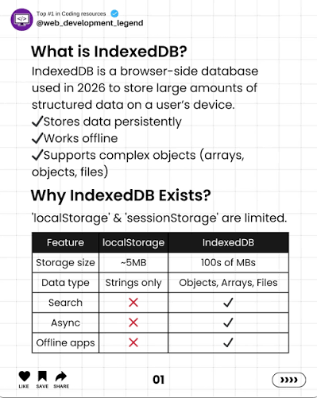
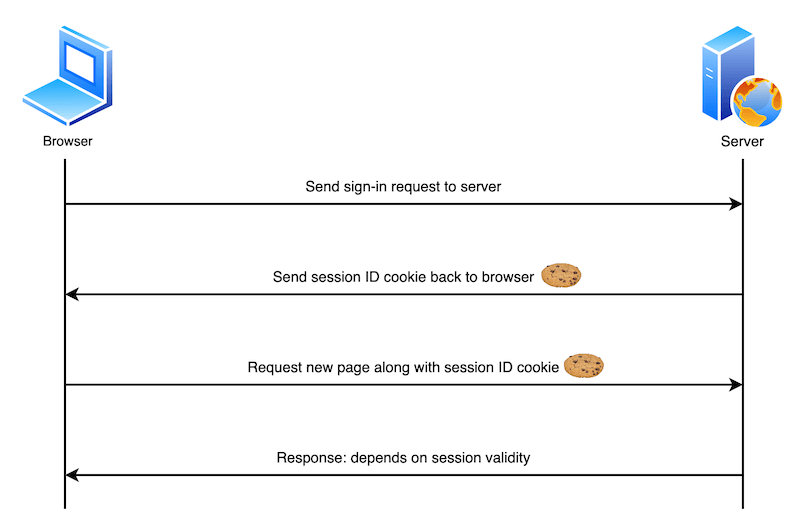
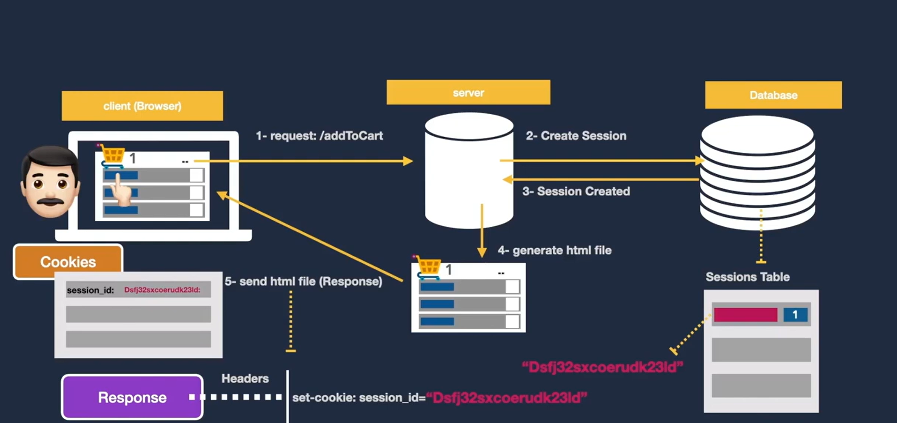
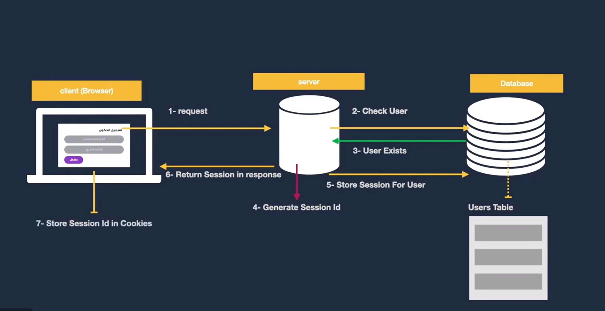
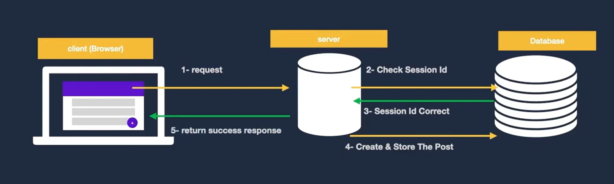
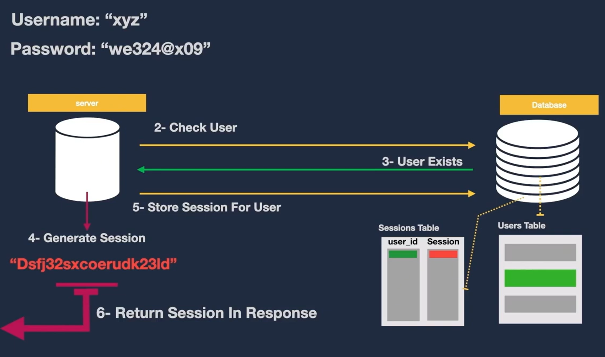
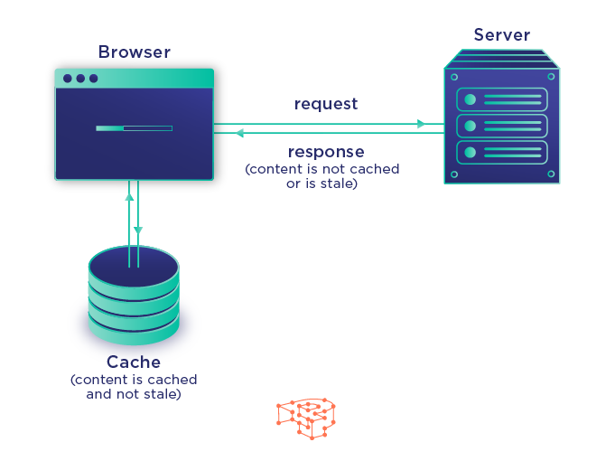

# Client-Side Storage: `localStorage` & `sessionStorage`

The **Web Storage API** is a built-in browser mechanism that allows you to store key-value pairs locally on the user's device.

---

## 1. Core Differences

| Feature | `localStorage` | `sessionStorage` |
| :--- | :--- | :--- |
| **Lifetime** | Permanent; data persists even after closing the browser until it is explicitly cleared (programmatically or manually). | Temporary; data is deleted as soon as the specific tab or window is closed. |
| **Scope** | Shared across all tabs and windows sharing the same Origin (Domain + Protocol + Port). | Confined strictly to the current tab; opening the same site in a new tab initializes a separate session storage. |
| **Storage Limit** | Roughly 5MB to 10MB per Origin. | Roughly 5MB per Origin. |

---

## 2. Essential Methods

Both APIs share the exact same set of methods. Simply replace `localStorage` with `sessionStorage` depending on your needs:

1. **`setItem(key, value)`**: Stores a key-value pair.
2. **`getItem(key)`**: Retrieves the value associated with the specified key.
3. **`removeItem(key)`**: Deletes a specific key-value pair.
4. **`clear()`**: Wipes out **all** data stored in that specific storage instance.

---

## 3. Code Examples

### A. Saving and Reading Simple Strings
```javascript
// Save data to localStorage
localStorage.setItem('theme', 'dark');

// Retrieve data from localStorage
const currentTheme = localStorage.getItem('theme'); // 'dark'

// Save data to sessionStorage
sessionStorage.setItem('tempID', '12345');

// Retrieve data from sessionStorage
const tempID = sessionStorage.getItem('tempID'); // '12345'
```

 # B. Handling Objects and Arrays (Crucial Gotcha ⚠️)
Web storage only accepts Strings. If you try to pass a JavaScript Object directly, the browser will automatically coerce it into "[object Object]". To prevent data corruption, always serialize with JSON.stringify() and deserialize with JSON.parse():
```js
const user = {
    name: 'Ahmed',
    age: 25,
    isPremium: true
};

// 1. Saving: Convert Object to a JSON String
localStorage.setItem('userData', JSON.stringify(user));

// 2. Reading: Retrieve String and parse it back into an Object
const savedUser = JSON.parse(localStorage.getItem('userData'));
console.log(savedUser.name); // 'Ahmed'

```
 # delete 
 ```js
// Remove a specific key
localStorage.removeItem('theme');

// Clear all items inside localStorage completely
localStorage.clear();

// Clear all items inside sessionStorage for the current tab only
sessionStorage.clear();
```

 ## Senior Insights & Performance Gotchas
 -- Synchronous Blocking: Web storage operations are synchronous. If you write or read large chunks of data, it will block the Main Thread and cause frame drops (UI freezing).

 -- Security Vulnerability: Never store sensitive data (such as JWT authentication tokens or user passwords) in localStorage. Any XSS (Cross-Site Scripting) vulnerability 
 can easily read window.localStorage and steal user sessions. Use HttpOnly Cookies for sensitive tokens instead.


# IndexedDB: The Browser's Native NoSQL Database

While `localStorage` is great for small strings, **IndexedDB** is the heavyweight champion for client-side storage. It is a full-featured, transactional NoSQL database built directly into the browser.

---

## 1. Why use IndexedDB? (Core Advantages)
1. **Massive Storage Capacity:** Unlike `localStorage` (capped around 5MB-10MB), IndexedDB can store hundreds of megabytes or even gigabytes of data depending on the user's disk space.
2. **Complex Data Types:** It doesn't just store strings; it can store native JavaScript objects, arrays, and even binary data like images or files (`Blobs`).
3. **Asynchronous Operations:** Unlike `localStorage` (which is synchronous and blocks the UI), IndexedDB operates **asynchronously**, meaning it won't freeze your Main Thread or drop your UI frames when handling heavy data.

---

## 2. Core Concepts
* **Database:** The container for your data, defined by a name and a version number.
* **Object Store:** Equivalent to a "Table" in SQL or a "Collection" in MongoDB. This is where your records live.
* **Key Path / Auto-increment:** The unique identifier for your records (e.g., an `id` field).
* **Transactions:** Every read or write operation happens inside a transaction. If something fails halfway through, the database automatically performs a rollback to maintain data integrity.

---

## 3. Real-World Usage & The "Gotcha" ⚠️
In professional production code, developers **rarely** use the native, raw IndexedDB API directly because of its complex boilerplate and event-driven syntax (`onsuccess`, `onerror`, `onupgradeneeded`). 

Instead, real-world apps use wrapper libraries like **Dexie.js** to make it feel clean and promise-based, or it runs under the hood of heavy offline-first web apps (like WhatsApp Web, Telegram Web, and PWA offline caches).

---

## 4. Code Examples

### A. Native IndexedDB API (The Raw Way)
```javascript
// 1. Open (or create) a database named "MyDatabase", version 1
const request = indexedDB.open("MyDatabase", 1);

// 2. Triggered if the DB is created for the first time or version changes
request.onupgradeneeded = function(event) {
    const db = event.target.result;
    if (!db.objectStoreNames.contains("users")) {
        // Create an object store with an auto-incrementing primary key
        db.createObjectStore("users", { keyPath: "id", autoIncrement: true });
    }
};

request.onsuccess = function(event) {
    const db = event.target.result;
    console.log("IndexedDB opened successfully!");
    addUser(db, { name: "Ahmed", role: "Frontend Developer" });
};

request.onerror = function(event) {
    console.error("IndexedDB error:", event.target.error);
};

// 3. Writing data using a transaction
function addUser(db, userData) {
    const transaction = db.transaction("users", "readwrite");
    const store = transaction.objectStore("users");
    const request = store.add(userData);

    request.onsuccess = function() {
        console.log("User added to IndexedDB successfully!");
    };
    
    request.onerror = function(error) {
        console.error("Failed to add user:", error);
    };
}
```
 # The Professional Way (Using Dexie.js Library)
 - Because native code is verbose, developers usually use wrappers like Dexie to make it modern and Promise-based:

```js
// Initialize database using 'Dexie'
const db = new Dexie("MyFriendDatabase");
db.version(1).stores({
    friends: '++id, name, age'
});

// Adding data becomes a clean async/await operation
async function addFriend() {
    try {
        await db.friends.add({ name: "Camilla", age: 25 });
        console.log("Friend added easily!");
    } catch (error) {
        console.error("Error:", error);
    }
}
```
 #  When Should You Use It?
- Building Offline-First applications (Notes apps, local-first task managers).

 - Storing large chunks of data fetched from an API to avoid redundant network requests.

 - Managing heavy client-side caching for complex apps alongside Service Workers.

 

 ## COOKIES
  - The Cookie is a small message from a web server passed to the user's browser when you visit a website. 
  - In other words, Cookies are small text files of information created/updated when visiting a website and stored on the user's web browser.
  - Cookies help websites remember users and track their activities to provide a personalised experience.
 # cookies uses
  - Authentication In Websites
  - Cart in E-commerce
  # types of cookies
  + There are several types of cookies which serve a unique functionality of use. We will discuss the 4 main types of cookies.

 - Session cookies
 - Persistent cookies
 - First-party cookies
 - Third-party cookies
 ```js

    function setCookie(name, value, daysToExpire) {
        const date = new Date();
        date.setTime(date.getTime() + (daysToExpire * 24 * 60 * 60 * 1000));
        const expires = "expires=" + date.toUTCString();
        document.cookie = name + "=" + value + "; " + expires;
        console.log(name+" cookie created");
    }

    // read cookie
    function getCookie(name) {
        console.log(document.cookie);
        const decodedCookie = decodeURIComponent(document.cookie);
        const cookies = decodedCookie.split(';');
        for (let i = 0; i < cookies.length; i++) {
            let cookie = cookies[i].trim();
            if (cookie.indexOf(name + "=") === 0) {
                return cookie.substring(name.length + 1);
            }
        }
        return null;
    }

    // delete cookie
    function deleteCookie(name) {
        document.cookie = name + "=; expires=Thu, 01 Jan 1970 00:00:00 UTC;";
        console.log(name+" cookie deleted");
    }

    // Set a cookie
    setCookie("userLanguage", "en-US", 30);

    // Read a cookie
    const language = getCookie("userLanguage");
    console.log("User's language: " + language);

    // Delete a cookie
    deleteCookie("userLanguage");

```







###  Browser Cache API (Offline-First Storage) for Progressive Web Apps (PWAs)

The **Cache API** is a specialized browser storage mechanism designed to store complete network requests and responses (`Request` and `Response` pairs) locally.
 - a browser-level storage mechanism that allows developers to programmatically save and retrieve network requests and their corresponding responses
#### Key Features:
* **Asset & Request Caching:** Stores static code files (HTML, CSS, JS, images) as well as API responses.
* **Offline Support:** Empowers Progressive Web Apps (PWAs) to load and function seamlessly even when the user loses internet connection.
* **Asynchronous Execution:** Built entirely on **Promises**, ensuring it runs in the background without blocking the browser's Main Thread.
* **Integration:** Works hand-in-hand with **Service Workers** to intercept network requests and serve cached content dynamically.


